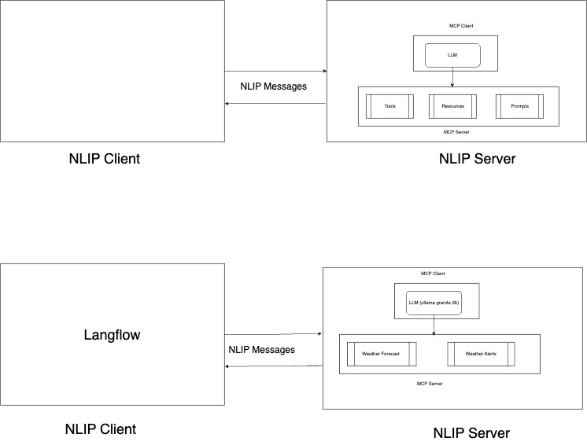

**# Powered by MCP**

This demo showcases the integration of both the MCP client and server within a single NLIP server.  
Message exchange follows the formats defined by NLIP.




## Prerequisites
- Python 3.x
- Ollama CLI
- Uvicorn

## Setup Steps

### 1. Install Ollama CLI
Download and install the Ollama CLI from [ollama.com](https://ollama.com).

### 2. Run Ollama Server with IBM Granite 2B Model
Run the Ollama server:

```bash
ollama run granite3.2:2b
```

### 3. Run MCP command line Client with MCP 

```bash
cd mcp-client  
uv venv
source .venv/bin/activate
```

```bash
source mcp-client/.venv/bin/activate
```
```bash
uv run client.py ../mcp-server/weather/weather.py
```


# Client command to send

```bash
curl -X POST http://localhost:8010/nlip/ \
-H "Content-Type: application/json" \
-d '{
  "format": "text",
  "subformat": "english",
  "content": "Who are you?"
}'
```

```bash
curl -X POST http://localhost:8010/nlip/ \
-H "Content-Type: application/json" \
-d '{
  "format": "text",
  "subformat": "english",
  "content": "What are the weather will be like for Indiana Bloomington?"
}'
```

```bash
curl -X POST http://localhost:8010/nlip/ \
-H "Content-Type: application/json" \
-d '{
  "format": "text",
  "subformat": "english",
  "content": "What is the weather in Bloomington, Indiana? My name is John Doe, email john.doe@example.com, SSN 123-45-6789."
}'
```